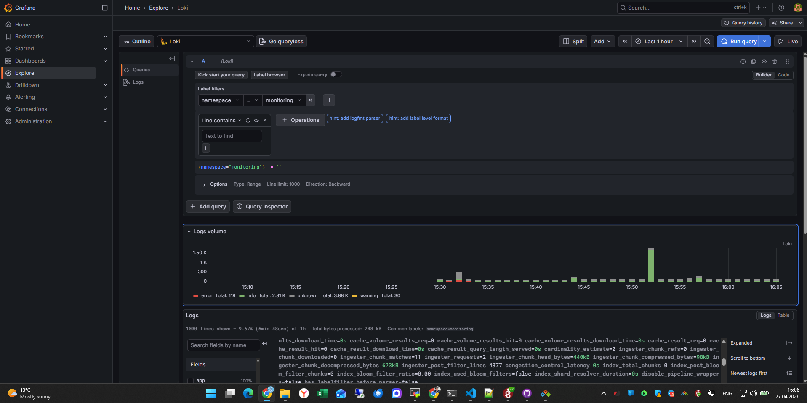
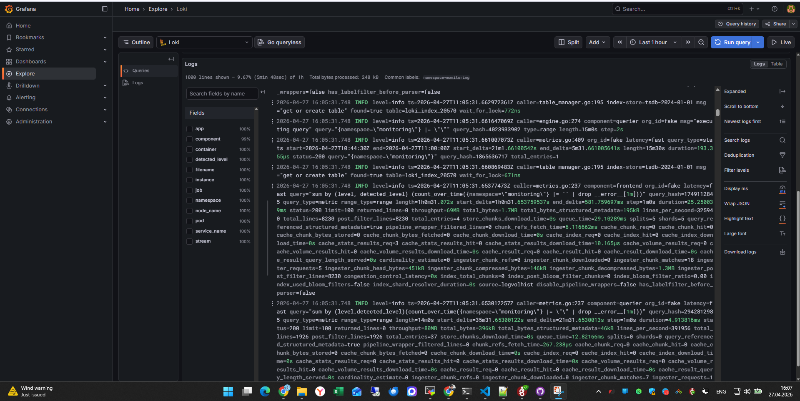

Прикладываю вывод команд по заданию: kubectl get node -o wide --show-labels и kubectl get nodes -o custom-columns=NAME:.metadata.name,TAINTS:.spec.taints

```
PS C:\Users\Maksim> kubectl get node -o wide --show-labels
NAME                        STATUS   ROLES    AGE     VERSION   INTERNAL-IP    EXTERNAL-IP     OS-IMAGE             KERNEL-VERSION       CONTAINER-RUNTIME     LABELS
cl1ej6bbbpu3lg4a1t6j-ybal   Ready    <none>   6h52m   v1.32.1   192.168.0.29   81.26.190.32    Ubuntu 22.04.5 LTS   5.15.0-168-generic   containerd://1.7.27   beta.kubernetes.io/arch=amd64,beta.kubernetes.io/instance-type=standard-v4a,beta.kubernetes.io/os=linux,failure-domain.beta.kubernetes.io/zone=ru-central1-d,kubernetes.io/arch=amd64,kubernetes.io/hostname=cl1ej6bbbpu3lg4a1t6j-ybal,kubernetes.io/os=linux,node-role=infra,node.kubernetes.io/instance-type=standard-v4a,node.kubernetes.io/kube-proxy-ds-ready=true,node.kubernetes.io/masq-agent-ds-ready=true,node.kubernetes.io/node-problem-detector-ds-ready=true,topology.kubernetes.io/zone=ru-central1-d,yandex.cloud/node-group-id=catacb92ibka9e4nvnkq,yandex.cloud/pci-topology=k8s,yandex.cloud/preemptible=false

cl1j9e7egt281tm04b5f-ulex   Ready    <none>   6h59m   v1.32.1   192.168.0.27   81.26.186.229   Ubuntu 22.04.5 LTS   5.15.0-168-generic   containerd://1.7.27   beta.kubernetes.io/arch=amd64,beta.kubernetes.io/instance-type=standard-v4a,beta.kubernetes.io/os=linux,failure-domain.beta.kubernetes.io/zone=ru-central1-d,kubernetes.io/arch=amd64,kubernetes.io/hostname=cl1j9e7egt281tm04b5f-ulex,kubernetes.io/os=linux,node.kubernetes.io/instance-type=standard-v4a,node.kubernetes.io/kube-proxy-ds-ready=true,node.kubernetes.io/masq-agent-ds-ready=true,node.kubernetes.io/node-problem-detector-ds-ready=true,topology.kubernetes.io/zone=ru-central1-d,yandex.cloud/node-group-id=cata0o1r2jinp1p7j7dd,yandex.cloud/pci-topology=k8s,yandex.cloud/preemptible=false``

```

В разделе Explore выбран datasource Loki и выполнен запрос {namespace="monitoring"}.

Логи успешно отображаются, что подтверждает работоспособность связки Promtail → Loki → Grafana.


---


